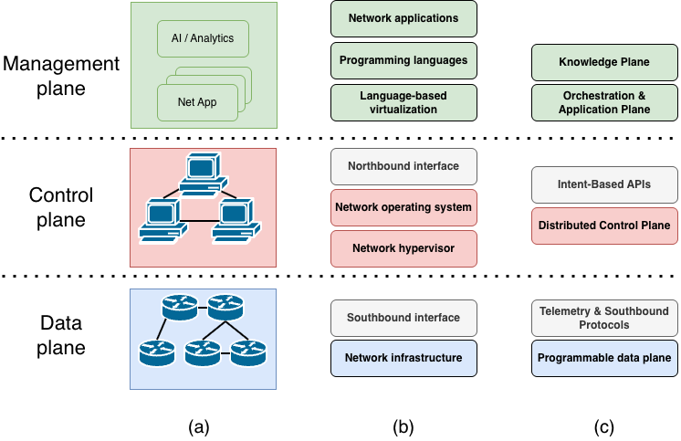
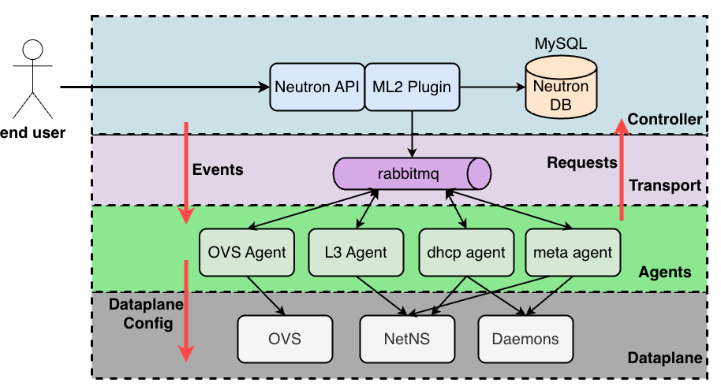
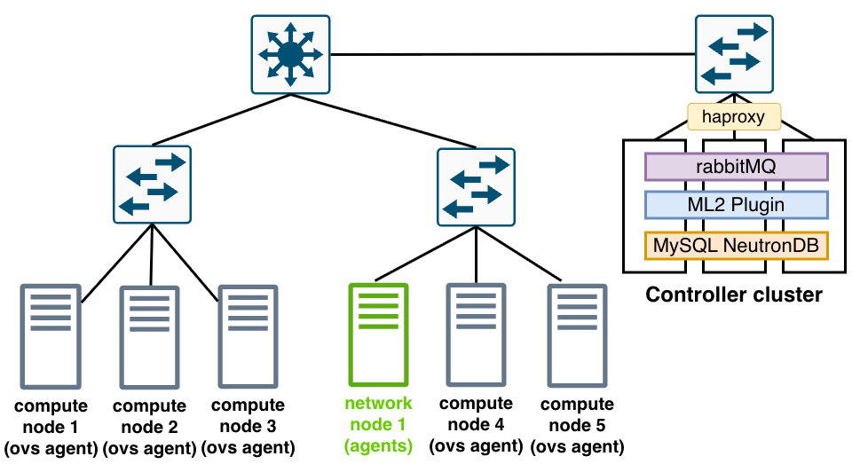
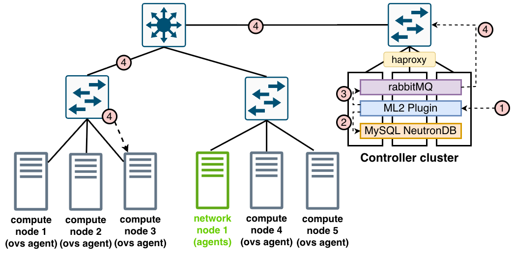
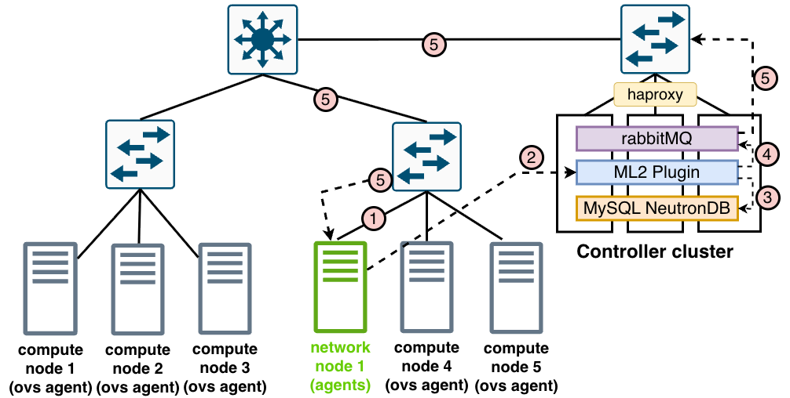

In this post, we talk about different SDNs, decisions behind them and neutron problems and how to solve them.

## I. Reality of building scalable clouds

Cloud computing is everywhere these days. The majority prefer hyperscalers, while others go for local or custom solutions. Building a cloud from scratch is a long, demanding project, so many opt for ready-to-go platforms where the groundwork is done, like OpenStack. While OpenStack is a monumental open-source achievement, it is fundamentally better suited for private clouds. In a public cloud at hyperscale, you hit hard limits.

To understand why, we have to look at SDN (Software-Defined Networking). SDN is not just a tool for configuring many devices at once, like Ansible. It is a complete paradigm shift where the control plane is separated from the networking hardware into a single, centralized entity. SDN is the backbone of the cloud. It virtualizes hardware, isolates tenants, and provides the rapid elasticity (or autoscaling) and resource pooling required by NIST cloud standards. Without a working SDN, you have no cloud. But developing an SDN is incredibly hard, and fundamental flaws in its architecture can force you to rip it out and start over or do a very costly migration (like we did).

## II. The Architecture of SDN solutions

Here we talk about SDN in general and how it is used in the cloud, it's important distinction because many of the features of cloud sdn like neutron or ovn seem like an overkill in a regular small-mid size datacenter e.g. 20 hypervisors.

## III. Neutron architecture: Design and Scaling Considerations

The architecture of OpenStack Neutron has its distinct advantages, having been originally designed to provide network-as-a-service for private clouds and enterprise environments. In these environments—typically involving a moderate number of hypervisors—its design works well to abstract complex networking. However, in large-scale public cloud deployments, the architecture faces significant scaling challenges. A core structural issue at scale is its heavy reliance on a centralized control plane communicating over a single message queue system (RabbitMQ) to synchronize state across hundreds or thousands of distributed agents.

### How neutron works

The Neutron architecture is separated into distinct layers: 
1. **Controller Layer**: The Neutron API receives requests. The ML2 (Modular Layer 2) Plugin implements the core logic for L2 networking. It receives the network configuration, writes the persistent state to the Database (MySQL/MariaDB), and dictates the network topology.
2. **Transport Layer**: A message broker, typically RabbitMQ, sits between the controller and the compute nodes. It handles the heavy lifting of routing RPC (Remote Procedure Call) messages between the plugins and the distributed agents.
3. **Agents**: These are Python daemons running on compute or network nodes that translate logical configurations into actual dataplane rules.

    3.1. **OVS Agent (Layer 2)**: Configures switching rules on the hypervisor's Open vSwitch (OVS). It is also typically responsible for implementing Security Groups (firewall rules) locally on the compute node.
    
    3.2. **L3 Agent**: Handles Layer 3 protocols, routing, and Floating IPs (NAT).

    3.3. **DHCP Agent**: Manages IP address assignment and static routes for virtual machines.

    3.4. **Metadata Agent**: Proxies requests from instances to the Nova metadata service.

4. **Dataplane**: This is the underlying Linux/Network infrastructure. Note: NetNS (Network Namespaces) and Daemons (like dnsmasq or radvd) are not agents themselves. They are Linux kernel features and processes managed by the agents. For example, the L3 and DHCP agents use NetNS to isolate tenant traffic, and the DHCP agent spawns dnsmasq daemons to serve IP addresses.

### How Neutron is typically deployed in Datacenter

### Neutron workflow example: port creation

### Neutron workflow example: network node full sync

## IV. The "Full Sync" Problem

- Openstack Neutron has a key mechanism called full sync. In general it’s a good idea that allows to make network consistent again relatively easy (especially for operations). But it can horribly backfire and one incident can cost a company millions of dollars.

- Dive deep into the war story mentioned in the hook. Without networks VMs and basically whole infrastructure is useless.

- Explain what a "full sync" is: A safety mechanism where an agent asks the controller for the entire state of the network to ensure it hasn't missed any messages.

- Explain the cascading failure: At 200k ports, the database is massive. When agents request a full sync, the Neutron server CPU spikes, the database gets hammered, and the RPC queue fills up. The system designed to heal the network effectively kills it.

- Explain a real case scenario what happens if power is lost (most common case is when power is lost).

## V. The Architectural Shift: Moving to the Modern Models

- Reference Column C ("The New Layer Model") in your diagram.

- Explain the shift from imperative RPC message queues to declarative REST APIs and state reconciliation (Intent-Based APIs).

- Introduce Sprut: Explain how migrating to a proprietary solution like VK Cloud's Sprut solved this. (You don't need code; focus on the architecture).

- Highlight the transition: Instead of a heavy central controller pushing massive state via RabbitMQ, modern systems separate the control plane into lightweight, distributed services that constantly poll their "Target State" vs. "Actual State" via HTTP REST APIs.

- ovn architectures

## VI. Conclusion and key takeaways

- Summarize the main takeaway: You cannot run a hyperscale cloud on an architecture designed for enterprise data centers.

- The Teaser: End with a bridge to your next article. (e.g., "Fixing the communication bottleneck is only half the battle. In the next article, we will look at the Data Plane—how separating SDN from NFV prevents your virtual switches from collapsing under the weight of complex network services.")

## What is SDN? 8 layer model

- use OS analogy from https://www.cs.utsa.edu/~korkmaz/teaching/ds-resources/sharvari-papers/survey-2015-Kreutz-sdn-comp-survey.pdf
- Control and data plane
-- Controller is centralized but reserved
- Forwarding devices and net os
- Northbound southbound interfaces
- Packet walkthrough
- A practical real world example of setting up same rule in datacenter via SDN vs Classical Networking vs Ansible + Networking
-- Data + control plane is stored within one device (unlike SDN)
-- Configure via CLI which is limited
-- Individual networking configurations
-- Control plane needs to communicate and there can be a lot of racks
-- SDN architecture is complex too though.
- How to make more reliable
-- Clustering
-- Seperation by regions each with separate controller using east west protocol
-- Hierarchal networking controllers

We define an SDN as a network architecture with four
pillars.
1) The control and data planes are decoupled. Control functionality is removed from network devices
that will become simple (packet) forwarding
elements.
2) Forwarding decisions are flow based, instead of
destination based. A flow is broadly defined by a
set of packet field values acting as a match (filter)
criterion and a set of actions (instructions). In the
SDN/OpenFlow context, a flow is a sequence of
packets between a source and a destination. All
packets of a flow receive identical service policies
at the forwarding devices [25], [26]. The flow
abstraction allows unifying the behavior of different types of network devices, including routers,
switches, firewalls, and middleboxes [27]. Flow
programming enables unprecedented flexibility,
limited only to the capabilities of the implemented flow tables [9].
3) Control logic is moved to an external entity, the
so-called SDN controller or NOS. The NOS is a
software platform that runs on commodity server
technology and provides the essential resources
and abstractions to facilitate the programming of
forwarding devices based on a logically centralized, abstract network view. Its purpose is therefore similar to that of a traditional operating system.
4) The network is programmable through software
applications running on top of the NOS that interacts with the underlying data plane devices.
This is a fundamental characteristic of SDN, considered as its main value proposition

## How SDN is built? Neutron
- Describe neutron architecture and how it maps to general model
- Describe vk implementation
- Neutron architectural decisions and why they were made
-- advantages
-- disadvantages

## Neutron disaster scenario
- Why disaster happened and how Nova Cells could've solved this

## Proprietary decisions
- Sprut as a solution.
- More durable
- Simplier dataplane
- Requires more resources to operate

## Sources
https://habr.com/ru/companies/vktech/articles/1000332/

https://github.com/vktechdev/evpn_connector

https://cloudification.io/cloud-blog/understanding-openstack-nova-cells-scaling-compute-across-data-centers/

https://superuser.openinfra.org/articles/openstack-neutron-networking-in-cloud-demystified/

https://aptira.com/theory-of-everything-in-neutron/

https://wiki.openstack.org/wiki/Neutron

comprehensive survey on sdn - https://www.cs.utsa.edu/~korkmaz/teaching/ds-resources/sharvari-papers/survey-2015-Kreutz-sdn-comp-survey.pdf

## Side notes

https://habr.com/ru/companies/vk/articles/763760/
- OpenFlow, FlowVisor, OpenvSwitch
- Active Networking
- SDN: Control and Data layer

Удешевление вычислительных ресурсов означало, что один простой сервер может хранить в себе и выполнять всю необходимую для большой сети логику по маршрутизации. Тут же обнаружились и дополнительные плюсы: бэкапы стало делать гораздо проще. 

4D: Data plane (процессинг пакетов на основе правил), Discovery plane (сбор топологии и измерение), Dissemination plane (размещение правил для обработки пакетов), Decision plane (логическое объединение контроллеров, реализующих обработку пакетов). Появились определяющие проекты: Ethane, SANE. Ethane стал предтечей OpenFlow — дизайн системы стал первой версией OpenFlow API. 

Openflow
Data plane с открытым интерфейсом, State management layer для поддержки консистентного понимания состояния сети и Control layer. 

Open virtual network in openstack

SDN стали основополагающим сервисом для облачных платформ. Одна из основных характеристик облака — это эластичность. Она, а также скорость и другие характеристики развёртываний подразумевают, что нижележащие сервисы должны быть максимально автоматизированы, отслеживая жизненный цикл объектов, на основе которых функционирует развёртываемый сервис. Например, для виртуальных машин это могут быть хранилище и сетевые настройки. Когда вы настраиваете виртуальную машину в любом облаке и переходите на вкладку сетей, чтобы настроить, в какой подсети будет виртуалка, вы участвуете в формировании запроса для SDN.

Лимиты архитектуры. Сам Mirantis говорит о том, что 500 узлов — это предел и Neutron не позиционируется как бесконечно масштабируемый продукт, который выдержит облачные масштабы. 

Переехать на другую SDN: Tungsten Fabric/OpenContrail, OpenDayLight, OVN. 
